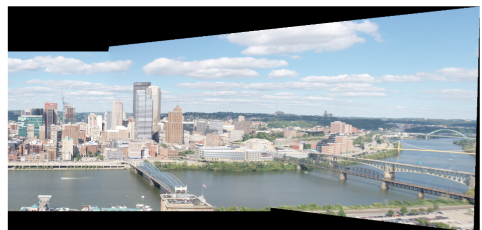
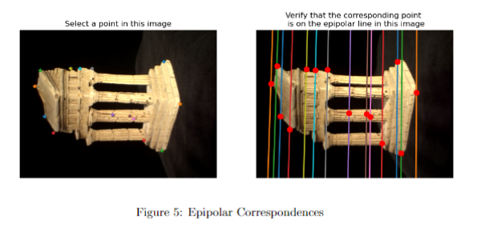
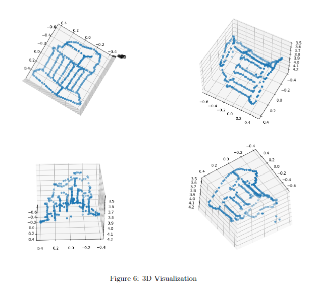
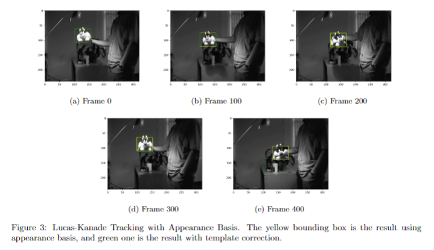
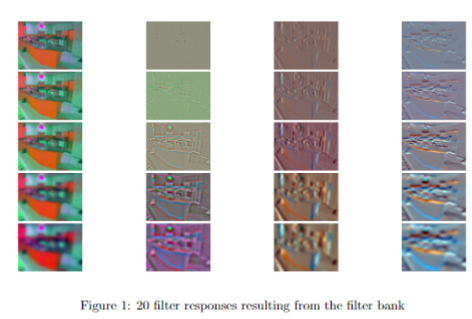
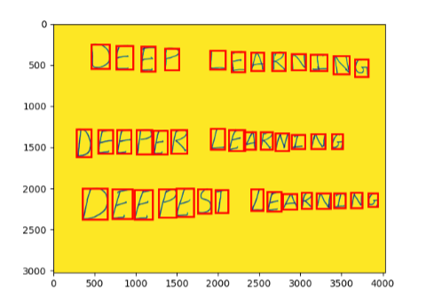
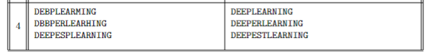

# COMP5421 Computer Vision Projects

## HW2: Feature Descriptors and Matching

We used SIFT for detecting keypoints and encoding features in two images, and used RANSAC to find homographically consistent matches, which then could be used to build a panorama image.

## HW4: Epipolar Geometry and 3D Reconstruction

We used epipolar constraints to find geometrically aligned correspondences in two images of the same object, and used the matches to construct a 3D point cloud of the object.  

## HW3: Tracking

We used different tracking methods for tracking objects across frames in a video.

## HW1: Visual Words

We used filter responses and deep features to construct a visual word bank, which could then be used to describe a picture. The set of visual words could be used to predict what type of scenery the image describe.

## HW5: Deep Learning for Computer Vision

Deep learning is used for text recognition.

## Note

Due to size limit problems, hw3's and hw1's data will not be included. hw5's data has also been deleted, but can be retrieved since it is a public dataset.