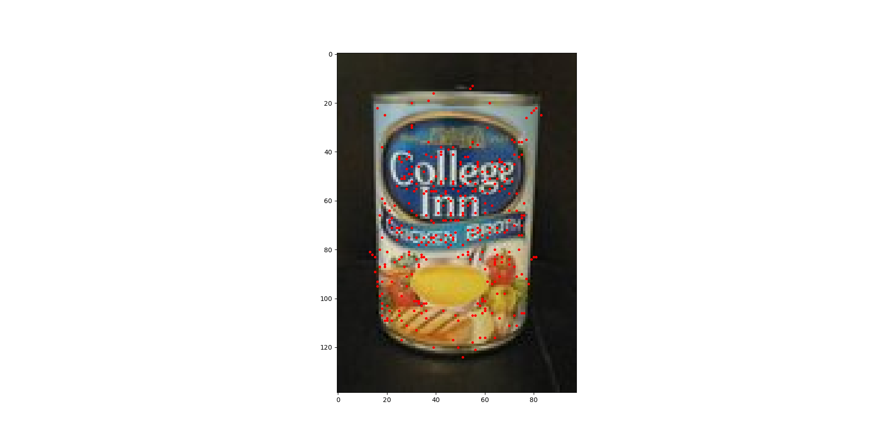
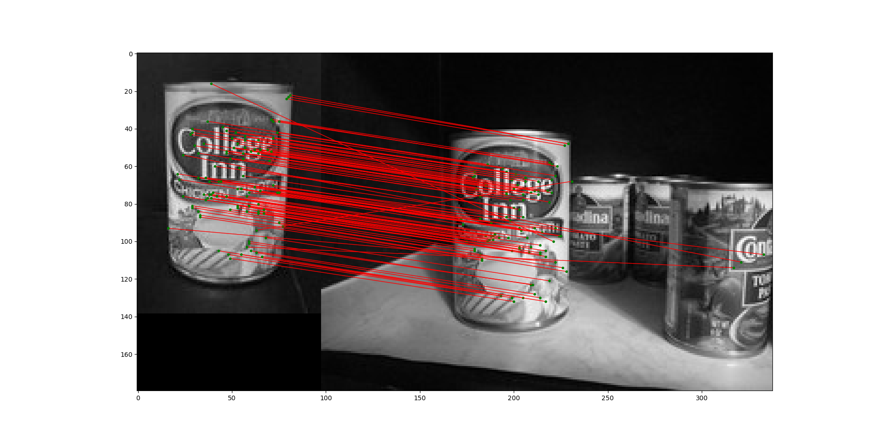
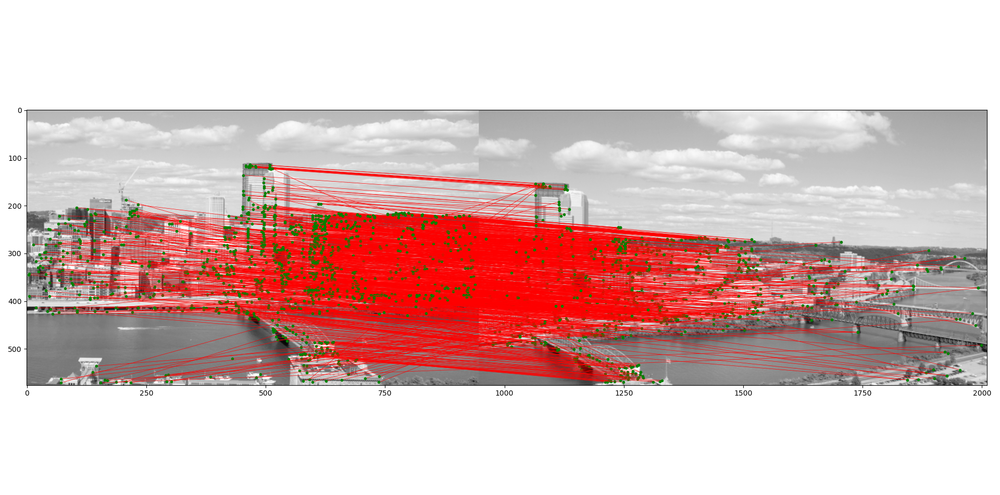
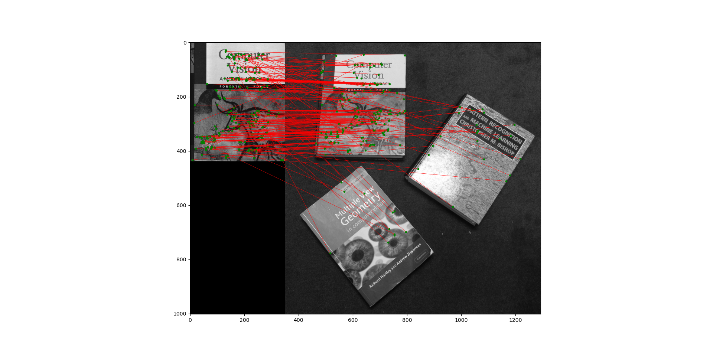
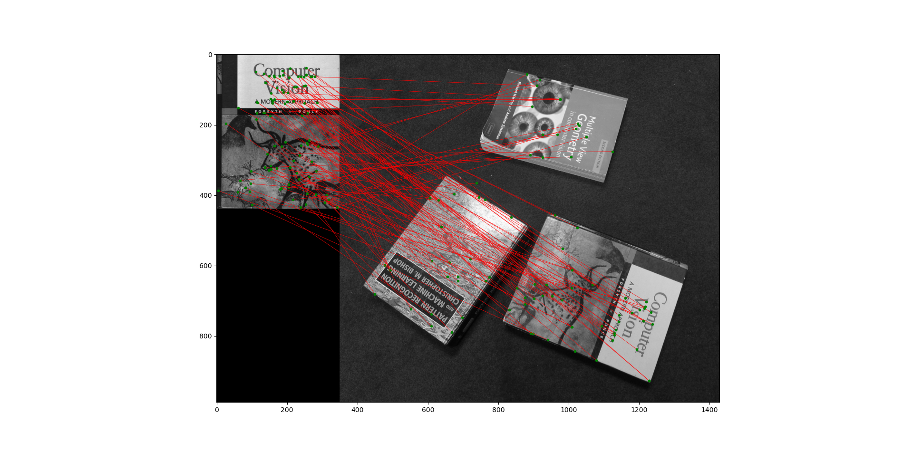
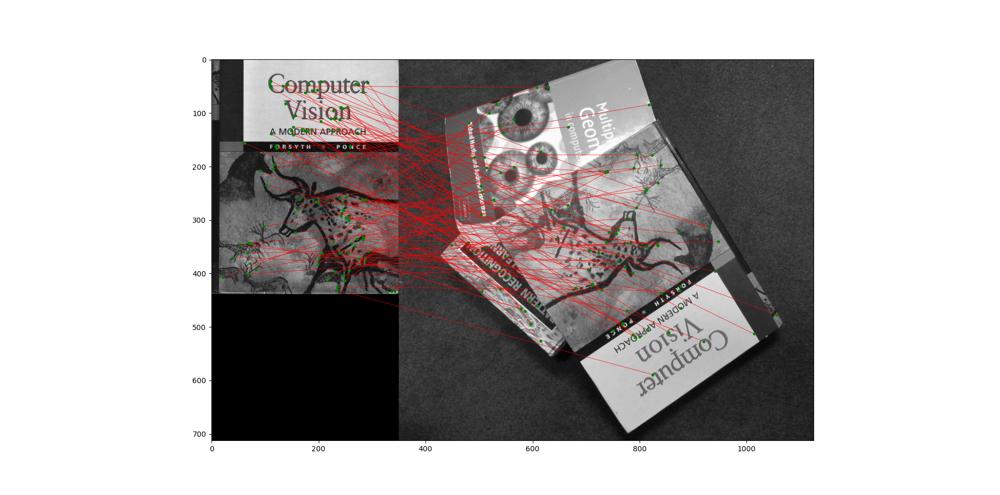
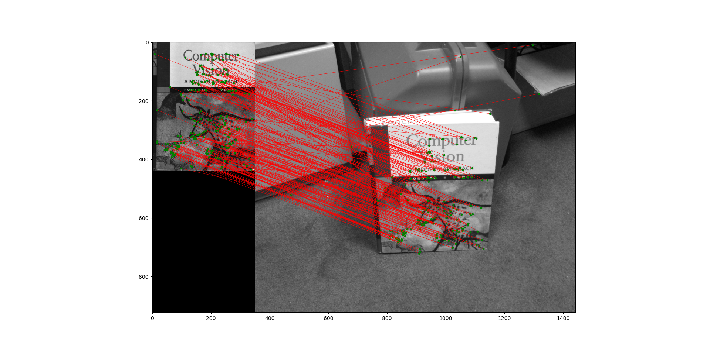
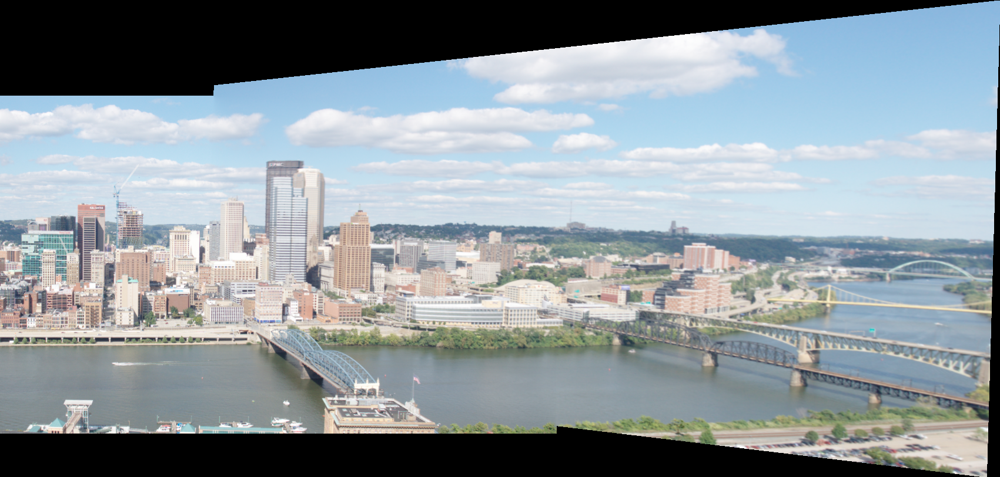
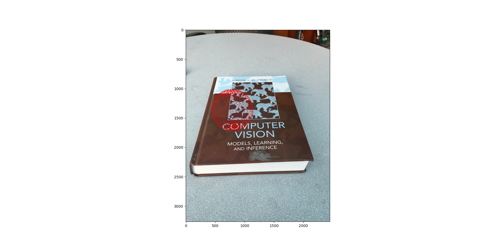

# Homework 2

Hartanto Kwee Jeffrey  
SID: 20851871  
Email: jhk@connect.ust.hk  

## Part 1 
### Task 1.5

Image (model_chickenbroth.jpg) with the detected keypoints:
  
  

## Part 2
### Task 2.4

Results of BRIEF descriptor matching for 3 sets of images:
1. Left: `model_chickenbroth.jpg`, right: `chickenbroth_01.jpg`
  
2. Left: `incline_L.png`, right: `incline_R.png`
  
3. Left: `pf_scan_scaled.jpg`, right: `pf_floor.jpg`
  
4. Left: `pf_scan_scaled.jpg`, right: `pf_floor_rot.jpg`
  
5. Left: `pf_scan_scaled.jpg`, right: `pf_pile.jpg`
  
6. Left: `pf_scan_scaled.jpg`, right: `pf_stand.jpg`
  

**Discussion**:
The `pf_pile.png` and `pf_floor_rot.png` image have the worst performance, with over half of the features wrongly mapped to other books and having much less matches than other images. The `pf_scan_scaled.jpg` also has incorrectly matched features. In contrast, the other images perform rather well, with most keypoints correctly mapped.  

### Task 2.5

Required bar graph:  

.png)  

The algorithm has relative high accuracy when the image is only rotated slightly, and completely fails at rotation angles greater than 20 degrees.

I believe this is due to the way the test point pairs are selected in BRIEF. Since the tests will compare the intensities between corresponding pixels in a patch around a keypoint, when the image is rotated by a large angle, the pixels being compared does not have a correspondence relationship. Slight rotations are counteracted by gaussian blur which merges rotated pixels, but large rotation will completely move the pixel away. That is why BRIEF descriptors are not rotation-invariant.

## Part 3

### Part (a)

For a point $w$ on the common plane, $\tilde{u}$ and $\tilde{x}$ are the
2D projected point on the first and second camera respectively. The two
are related by a relationship 
$$\lambda \tilde{x}=H\tilde{u}$$

For $N$ pairs of such points, we have

$$\begin{aligned}
\lambda _{n}\widetilde{x_{n}}&=H\widetilde{u_{n}} \\
\lambda _{n}\left[\begin{array}{c}
\widetilde{x_{xn}}\\
x_{yn}\\
1
\end{array}\right]&=\begin{bmatrix}
H_{11} & H_{12} & H_{13}\\
H_{21} & H_{22} & H_{23}\\
H_{31} & H_{32} & H_{33}
\end{bmatrix}\left[\begin{array}{c}
\widetilde{u_{xn}}\\
\widetilde{u_{yn}}\\
1
\end{array}\right]=\left[\begin{array}{c}
-{h}_{1}^{T}-\\
-{h}_{2}^{T}-\\
-{h}_{3}^{T}-
\end{array}\right]\widetilde{u_{n}} \end{aligned}$$

We let $h=\left[\begin{array}{cccc}
H_{11} & H_{12} & \ldots & H_{33}
\end{array}\right]^{T}$. Then for one set of points,

$$\begin{aligned}
\lambda _{n}\widetilde{x_{xn}}&={h}_{1}^{T}\widetilde{u_{n}} \\
\lambda _{n}\widetilde{x_{yn}}&={h}_{2}^{T}\widetilde{u_{n}} \\
\lambda _{n}&={h}_{3}^{T}\widetilde{u_{n}} \end{aligned}$$

which can be reduced to

$$\begin{aligned}
{h}_{1}^{T}\widetilde{u_{n}}-\left({h}_{3}^{T}\widetilde{u_{n}}\right)\widetilde{x_{xn}}&=0 \\
{h}_{2}^{T}\widetilde{u_{n}}-\left({h}_{3}^{T}\widetilde{u_{n}}\right)\widetilde{x_{yn}}&=0 \end{aligned}$$

In matrix form, 

$$A_{n}=\left[\begin{array}{ccc}
\widetilde{u_{n}}^{T} & 0 & -\widetilde{x_{xn}}\widetilde{u_{n}}^{T}\\
0 & \widetilde{u_{n}}^{T} & -\widetilde{x_{yn}}\widetilde{u_{n}}^{T}
\end{array}\right]\left[\begin{array}{c}
h_{1}\\
h_{2}\\
h_{3}
\end{array}\right]$$

Repeat this $N$ times to get

$$A=\left[\begin{array}{c}
A_{1}\\
A_{2}\\
\vdots \\
A_{N}
\end{array}\right]$$ 

### Part (b)

There are 9 elements in $h$.

### Part (c)

$H$ has 9 elements, but is only defined up to scale (because it relates homogenous coordinates). Hence, it only has $9 - 1 = 8$ degrees of freedom.

Each point correspondence gives two linear equations (derived above).

Therefore, we need $8/2=4$ point correspondences to solve the system.

### Part (d)

1\. Compute the SVD of $A$ to get $U\Sigma V^{T}$.

2\. The solutions for $h$ is given by the rightmost column of the matrix
$V$.

## Part 6

### Task 6.3

This is the final unclipped panorama:

## Part 7

The code for this section can be found in `augmentedReality.py`.

### Task 7.2

Here is the final image:

