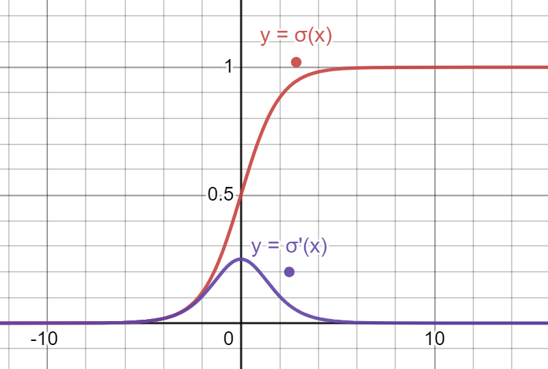
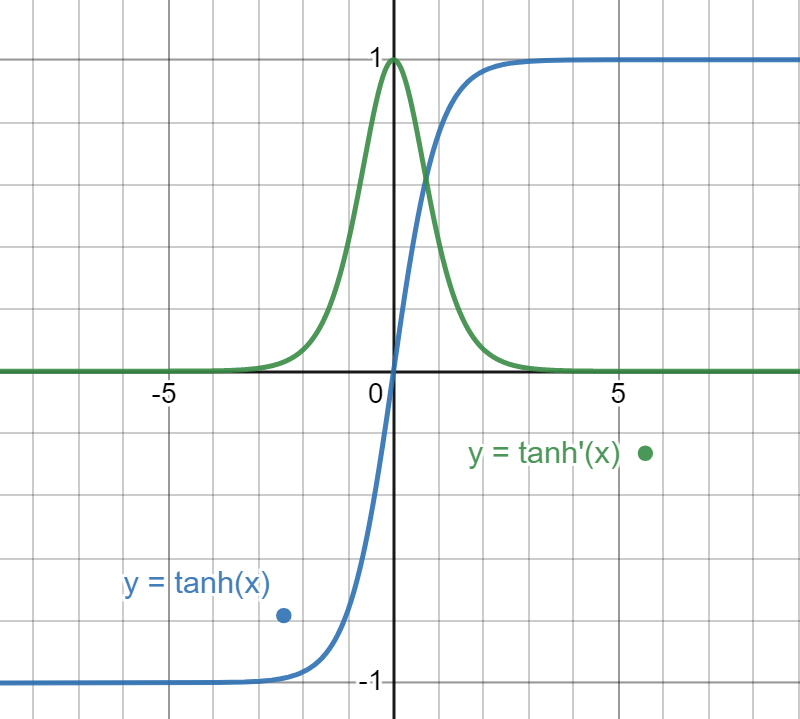

<link rel="stylesheet" href="writeup.css">

# Homework 5

Hartanto Kwee Jeffrey  
SID: 20851871  
Email: jhk@connect.ust.hk  

## Task 1

### Task 1.1

With the translated vector as $x+c$, we have
$$\begin{aligned}
\text{softmax}((x+c)_i)&=\dfrac{e^{(x+c)_i}}{\sum_j e^{(x+c)_j}} \\ 
&= \dfrac{e^{x_i+c}}{\sum_j e^{x_j+c}} \\
&= \dfrac{e^{x_i}e^c}{\sum_j e^{x_j}e^c} \\
&= \dfrac{e^{x_i}}{\sum_k e^{x_j}} \\
&= \text{softmax}(x_i)
\end{aligned}$$
If we use $c=-\max x_i$, then $(x+c)_i=x_i-\max x_j\leq0$, making $0\leq e^{(x+c)_i}\leq 1$. Restricting the range of values of the exponents to a smaller range makes calculations more stable, since large exponents are difficult to calculate.

### Task 1.2 **Review Before Submission**
- Each element is between 0 to 1. The sum over all elements is 1. (Softmax is also differentiable.)
- “softmax takes an arbitrary real valued vector x and turns it into a <u>probability distribution function</u>"
- The multi-step process allows the calculation to be efficiently executed using vector operations (e.g. in `numpy`):
  1. $s_i=e^{x_i}$ calculates the exponent of each element, e.g. `s = np.exp(x)`. 
  2. $S=\sum{s_i}$ calculates the sum of the exponents, e.g. `S = np.sum(s)`.
  3. $\text{softmax}(x_i)=\dfrac{1}{S}s_i$ normalizes the vector using $S$, e.g. `softmax = (1/S)*s`, and this makes the sum across all elements 1.

### Task 1.3

Without a non-linear activation function (i.e. with a linear activation function, e.g. $f(\mathbf{x})=A\mathbf{x}+B$ for $A,B\in\mathbb{R}$, we obtain the folllowing expression for relating the activation vectors between layers $l$ and $l-1$:
$$\begin{aligned}
\mathbf{a}^{(l)}&=f(\mathbf{z}^{(l)})\\
&=f(\mathbf{W}^{(l)}\mathbf{a}^{(l-1)}+\mathbf{b}^{(l)})\\
&=A(\mathbf{W}^{(l)}\mathbf{a}^{(l-1)}+\mathbf{b}^{(l)})+B\\
&=A\mathbf{W}^{(l)}\mathbf{a}^{(l-1)}+\left[A\mathbf{b}^{(l)}+B\right]\\
&=(\text{some matrix})\mathbf{a}^{(l-1)}+(\text{some vector})\hspace{1em} \dots (*)
\end{aligned}$$
where $\mathbf{W}^{(l)}\in\mathbb{R}^{n_{l-1}\times n_l}$ and $\mathbf{b}^{(l)}\in\mathbb{R}^{n_l}$ are the weights and biases connecting the two layers.
Applying this recurrence relationship repeatedly, we eventually find that the outputs $\mathbf{y}=\mathbf{a}^{(N-1)}$ and the inputs $\mathbf{x}=\mathbf{a}^{(0)}$ are related by
$$\mathbf{y}=\mathbf{Px}+\mathbf{Q}$$
where $\mathbf{P}$ and $\mathbf{Q}$ results from repeated multiplication and addition of the matrices in $(*)$. We see this is basically the linear regression model.  

In the backpropagation step, we try to minimize the sum of square errors $L=||\mathbf{y}-\hat{\mathbf{y}}||_2^2$, which is also the error we are minimizing in linear regression.

Hence, we conclude that without a non-linear activation function, a multi-layer neural network reduces to linear regression.

### Task 1.4
$$\begin{aligned}
\sigma(x)&=\dfrac{1}{1+e^{-x}}\\
e^{-x}&=\dfrac{1}{\sigma(x)}-1\\
\dfrac{d}{dx}(e^{-x})&=\dfrac{d}{dx}\left[\dfrac{1}{\sigma(x)}-1\right]\\
-e^{-x}&=-\dfrac{1}{[\sigma(x)]^2}\cdot\sigma'(x)\\
\dfrac{1}{\sigma(x)}-1&=\dfrac{1}{[\sigma(x)]^2}\cdot\sigma'(x)\\
\sigma'(x)&=\sigma(x)(1-\sigma(x))
\end{aligned}$$
In terms of $x$, $\sigma'(x)=\dfrac{1}{1+e^{-x}}\left(1-\dfrac{1}{1+e^{-x}}\right)=\dfrac{e^{-x}}{[1+e^{-x}]^2}$.


### Task 1.5
We are given $y=x^{T}W+b$ and $y_{j}=\sum_{i = 1}^{d} x_{i} W_{i j} + b_{j}$. 

Note that $J$ is a function of $y_i$ for $j=1,2,...,k$.

By applying chain rule, we have

$$
\begin{aligned}
\dfrac{\partial J}{\partial W_{i j}}&=\sum_{j ' = 1}^{k} \dfrac{\partial J}{\partial y_{j '}} \dfrac{\partial y_{j '}}{\partial W_{i j}}=\delta_{j}\dfrac{\partial}{\partial W_{i j}}\left(\sum_{i = 1}^{d} x_{i} W_{i j} + b_{j}\right)=\delta_{j}x_{i} \\
\dfrac{\partial J}{\partial x_{i}}&=\sum_{j = 1}^{k} \dfrac{\partial J}{\partial y_{j}} \dfrac{\partial y_{j}}{\partial x_{i}}=\sum_{j = 1}^{k} \delta_{j} \dfrac{\partial}{\partial x_{i}} \left(\sum_{i = 1}^{d} x_{i} W_{i j} + b_{j}\right)=\sum_{j = 1}^{k} \delta_{j} W_{i j}\\
\dfrac{\partial J}{\partial b_{j}}&=\sum_{j ' = 1}^{k} \dfrac{\partial J}{\partial y_{j '}} \dfrac{\partial y_{j '}}{\partial b_{j}}=\delta_{j}\left(1\right)=\delta_{j}
\end{aligned}
$$

In matrix form (denominator-layout notation),

$$
\begin{aligned}
\dfrac{\partial J}{\partial W}&=\begin{bmatrix} \dfrac{\partial J}{\partial W_{11}} & \dfrac{\partial J}{\partial W_{12}} & \dots & \dfrac{\partial J}{\partial W_{1 k}} \\ \dfrac{\partial J}{\partial W_{21}} & \dfrac{\partial J}{\partial W_{22}} & \dots & \dfrac{\partial J}{\partial W_{2 k}} \\ \vdots & \vdots & \ddots & \vdots \\ \dfrac{\partial J}{\partial W_{d 1}} & \dfrac{\partial J}{\partial W_{d 2}} & \dots & \dfrac{\partial J}{\partial W_{d k}} \end{bmatrix}=\begin{bmatrix} \delta_{1} x_{1} & \delta_{2} x_{1} & \dots & \delta_{k} x_{1} \\ \delta_{1} x_{2} & \delta_{2} x_{2} & \dots & \delta_{k} x_{2} \\ \vdots & \vdots & \ddots & \vdots \\ \delta_{1} x_{d} & \delta_{2} x_{d} & \dots & \delta_{k} x_{d} \end{bmatrix}=x\delta^{T}\\
\dfrac{\partial J}{\partial x}&=W\delta\\
\dfrac{\partial J}{\partial b}&=\delta
\end{aligned}
$$

### Task 1.6
1. Observe the plotted gradient of the sigmoid    function:



We can see that the range of values of $\sigma'(x)$ is very small ($\leq0.25$). During backpropogation, the gradients for progressively early layers will decrease exponential due to the repeated multiplication of $\sigma'(x)$ in chain rule. This significantly slows down the updating of weights in earlier layers, causing a "vanishing gradient".

2. The output range of sigmoid is $(0,1)$, while that of $\tanh{}$ is $(-1,1)$. We prefer $\tanh$ because the range of output is stretched to $(-1,1)$ and in backpropagation, it makes the gradient ($\nabla_{W_i{ij}}J\propto\delta_j(y)$) greater which leads to quicker convergence.

3. This is because the gradient of $\tanh$ is steeper: its maximum gradient is 1, 4 times greater than that of sigmoid. This makes the problem of vanishing gradient less likely.


   
4. Since $e^{- x}=\dfrac{1 - \sigma \left(x\right)}{\sigma \left(x\right)}\Longrightarrow e^{- 2 x}=\dfrac{1 - \sigma \left(2 x\right)}{\sigma \left(2 x\right)}$, we have
$$ \tanh ⁡ \left(x\right)=\dfrac{1 - e^{- 2 x}}{1 + e^{- 2 x}}=\dfrac{1 - \dfrac{1 - \sigma \left(2 x\right)}{\sigma \left(2 x\right)}}{1 + \dfrac{1 - \sigma \left(2 x\right)}{\sigma \left(2 x\right)}}=2\sigma\left(2 x\right)-1 $$

## Task 2

### Task 2.1
#### Q2.1.1
If we initialize the network with zero weights and biases, for ReLu/linear/tanh activation functions where $f(0)=0$, the network will only be able to output zeros since the hidden layers evaluate to zero, and backpropagation gradient will also be zero because the weights and outputs are zero (refer to the equations derived in Q1.5 and Q2.3). The network, as a result, is unable to train.

For single-output neural networks, even if the outputs are not zero, the gradient will be the same for all weights, so all of the weights are updated the same way, causing inherent symmetry within weights and hence has poor accuracy.

For sigmoid networks (non-zero output at 0) like the one we implemented, the convergence will be slower because normally the neuron weights at loss function minima will be far from all 0, and it will take more backpropagation steps to reach a local minima.

#### Q2.1.3
We use random initialization to "break symmetry", solving the problem with zero/constant-initialization and increasing accuracy. Also, running the program multiple times with randomly initialized weights can give different and perhaps better results.

Scaling the initialization controls the sizes of the gradients and hence the sizes. If we view the update rules, the gradient fed to a layer involves summing up the weights of the previous layer. Scaling the weights according to layer size controls the size of this sum, and prevents vanishing or exploding gradients. This helps stablize and speed up the gradient descent.

#### Q2.3

The derivations for the gradients are list below.

Definition of the neural network:
$$a^{\left(t\right)}=W^{\left(t\right)}h^{\left(t - 1\right)}+b^{\left(t\right)}$$
$$h^{\left(t\right)}=g\left(a^{\left(t\right)}\right),\textrm{ }h^{\left(T\right)}=o\left(a^{\left(T\right)}\right)$$
The dimensions of the variables are $W^{\left(t\right)}\in R^{n^{\left(t - 1\right)} \times n^{\left(t\right)}}$ and $h^{\left(t\right)},a^{\left(t\right)},\textrm{ }b^{\left(T\right)}\in R^{n^{\left(t\right)} \times 1}$.

The gradient of $\text{cross-entropy}(\text{softmax}(x))$:
$$\frac{\partial J}{\partial a_{i}^{\left(T\right)}}=h_{i}^{\left(T\right)}-y_{i}\Longrightarrow\frac{\partial J}{\partial a^{\left(T\right)}}=h^{\left(T\right)}-y$$

The gradients of the output layer (should be consistent with Q1.5) are
$$
\begin{aligned}
\frac{\partial J}{\partial W_{i j}^{\left(T\right)}}&=\sum_{j^{'} = 1}^{n^{\left(T\right)}} \frac{\partial J}{\partial a_{j^{'}}^{\left(T\right)}} \frac{\partial a_{j^{'}}^{\left(T\right)}}{\partial W_{i j}^{\left(T\right)}}=\frac{\partial J}{\partial a_{j}^{\left(T\right)}}\frac{\partial a_{j}^{\left(T\right)}}{\partial W_{i j}^{\left(T\right)}}=\left[h_{j}^{\left(T\right)} - y_{j}\right]h_{i}^{\left(T - 1\right)}&\\&\Longrightarrow\frac{\partial J}{\partial W^{\left(T\right)}}=h^{\left(T - 1\right)}\left(\left[h^{\left(T\right)} - y\right]\right)^{T}\\
\frac{\partial J}{\partial b_{j}^{\left(T\right)}}&=\sum_{j^{'} = 1}^{n^{\left(T\right)}} \frac{\partial J}{\partial a_{j^{'}}^{\left(T\right)}} \frac{\partial a_{j^{'}}^{\left(T\right)}}{\partial b_{j}^{\left(T\right)}}=\frac{\partial J}{\partial a_{j}^{\left(T\right)}}\frac{\partial a_{j}^{\left(T\right)}}{\partial b_{j}^{\left(T\right)}}=\left[h_{j}^{\left(T\right)} - y_{j}\right]&\\&\Longrightarrow\frac{\partial J}{\partial b^{\left(T\right)}}=h^{\left(T\right)}-y\\
\frac{\partial J}{\partial h_{i}^{\left(T - 1\right)}}&=\sum_{j^{'} = 1}^{n^{\left(T\right)}} \frac{\partial J}{\partial a_{j^{'}}^{\left(T\right)}} \frac{\partial a_{j^{'}}^{\left(T\right)}}{\partial h_{i}^{\left(T - 1\right)}}=\sum_{j^{'} = 1}^{n^{\left(T\right)}}\left[h^{\left(T\right)} - y\right]_{j^{'}} \frac{\partial a_{j^{'}}^{\left(T\right)}}{\partial h_{i}^{\left(T - 1\right)}}=\sum_{j^{'} = 1}^{n^{\left(T\right)}}\left[h^{\left(T\right)} - y\right]_{j^{'}} W_{i j^{'}}^{\left(T\right)}&\\&\Longrightarrow\frac{\partial J}{\partial h^{\left(T - 1\right)}}=W^{\left(T\right)}\left[h^{\left(T\right)} - y\right]
\end{aligned}
$$

The gradients of the hidden layers are
$$
\begin{aligned}
\frac{\partial J}{\partial W_{i j}^{\left(T - 1\right)}}&=\sum_{j^{'} = 1}^{n^{\left(T - 1\right)}} \frac{\partial J}{\partial h_{j '}^{\left(T - 1\right)}} \frac{\partial h_{j '}^{\left(T - 1\right)}}{\partial a_{j '}^{\left(T - 1\right)}} \frac{\partial a_{j '}^{\left(T - 1\right)}}{\partial W_{i j}^{\left(T - 1\right)}}=\frac{\partial J}{\partial h_{j}^{\left(T - 1\right)}}g^{'}\left(a_{j}^{\left(T - 1\right)}\right)h_{i}^{\left(T - 2\right)}&\\&\Longrightarrow\frac{\partial J}{\partial W^{\left(T - 1\right)}}=h^{\left(T - 2\right)}\left[\frac{\partial J}{\partial h^{\left(T - 1\right)}} \odot g^{'} \left(a^{\left(T - 1\right)}\right)\right]^{T}\\
\frac{\partial J}{\partial b_{j}^{\left(T - 1\right)}}&=\sum_{j^{'} = 1}^{n^{\left(T - 1\right)}} \frac{\partial J}{\partial h_{j '}^{\left(T - 1\right)}} \frac{\partial h_{j '}^{\left(T - 1\right)}}{\partial a_{j '}^{\left(T - 1\right)}} \frac{\partial a_{j '}^{\left(T - 1\right)}}{\partial b_{j}^{\left(T - 1\right)}}=\frac{\partial J}{\partial h_{j}^{\left(T - 1\right)}}g^{'}\left(a_{j}^{\left(T - 1\right)}\right)&\\&\Longrightarrow\frac{\partial J}{\partial b^{\left(T - 1\right)}}=\frac{\partial J}{\partial h^{\left(T - 1\right)}}\odot g^{'}\left(a^{\left(T - 1\right)}\right)\\
\frac{\partial J}{\partial h_{i}^{\left(T - 2\right)}}&=\sum_{j^{'} = 1}^{n^{\left(T - 1\right)}} \frac{\partial J}{\partial h_{j '}^{\left(T - 1\right)}} \frac{\partial h_{j '}^{\left(T - 1\right)}}{\partial a_{j '}^{\left(T - 1\right)}} \frac{\partial a_{j '}^{\left(T - 1\right)}}{\partial h_{i}^{\left(T - 2\right)}}=\sum_{j^{'} = 1}^{n^{\left(T - 1\right)}} \frac{\partial J}{\partial h_{j '}^{\left(T - 1\right)}} g^{'} \left(a_{j '}^{\left(T - 1\right)}\right) W_{i j^{'}}^{\left(T - 1\right)}&\\&\Longrightarrow\frac{\partial J}{\partial h^{\left(T - 2\right)}}=W^{\left(T - 1\right)}\left[\frac{\partial J}{\partial h^{\left(T - 1\right)}} \odot g^{'} \left(a^{\left(T - 1\right)}\right)\right]
\end{aligned}
$$
Note that since our network only has two layers, $h^{(T-2) }=x$.
Also note that in our implementation, $h$, $b$ and $a$ are one-dimensional. Transposition may be needed at times.

## Task 3

### Task 3.1.2

With best accuracy, the parameters are
```
max_iters = 150
batch_size = 50
learning_rate = 8e-4
```

The plot for the best learning rate:


The plot for the best learning rate x10:


The plot for the best learning rate x0.1:


For the best network (i.e. the original learning rate),
```
Training Accuracy:  0.8717592592592597
Validation accuracy:  0.7716666666666666
Test Accuracy:  0.7844444444444445
```

Obviously, deviation from most optimal learning rate will decrease accuracy. 

For a smaller learning rate, gradient descent step size is reduced, leading to slower convergence.

For a larger learning rate, gradient descent doesn't happen significantly faster, but may cause the loss to increase and fluctuate due to errors induced by large gradient steps (in a similar fashion as the erratic behaviour of large step size in Euler method). Simply said, it is easier to overshoot a local minima with a large step size.

### Task 3.1.3

Initialized network weights:  


Trained network weights:


There is no observable pattern in the initial weights, but there are large bright and dark patches in the trained weights. This may signify that the network classifies the characters by seeing if different regions in an image are filled in.

There are also layers with random weights. These random weights probably failed to train, and their contribution to the final output (i.e. weight to the output layer) is probably small.

### Task 3.1.4

The confusion matrix for the original learning rate is:


The pairs the are most easily confused in this specific network are [0, O], [S, 5], [2, Z], [W, U]. These pairs are structurally similar, and only differ in whether they have sharp corners or not (and corners often become rounded in handwriting). These letter are usually confused by humans too, but are usually correctable by understanding the context in which the letter is used. However, it would be difficult for the network to differentiate between them.

## Task 4

### Task 4.1

Assumptions:
1. All characters in the image are either alphabets (upper-case) or digits.
2. The whole image contains only the piece of paper that the alphabet is written on, and does not include other objects such as the tabletop, cups, pens, etc.

### Task 4.3
Later

### Task 4.4

First Image
```
FQJQLIST
LMAREATDDSLIST
2TLHHIFNCGKQDNFFTTQHEDQFLIIRSSTT
3LRQ6MAPLLI6TZJEDY2QUTHIMNVBGSALR6ADT
9ARFNWAAPRDYQUR5ELFWITH
```
Ground truth:
```
TODOLIST
1MAKEATODOLIST
2CHECKOFFTHEFIRST
THINGONTODOLIST
3REALIZEYOUHAVEALREADY
COMPLETED2THINGS
4REWARDYOURSELFWITH
ANAP
```


Second Image
```
ABLDBFG
HLIKLMN
QPQKSTU
VWXYZ
1Z3GS6787J
```
Ground Truth:
```
ABCDEFG
HIJKLMN
OPQRSTU
VWXYZ
1234567890
```
Accuracy: 0.722, consistent

Third Image
```
HAIKUSARHHABY
BUTSDMETIMESTRETDDWTMAK6BHMQE
RBGRIGBRATQK
```
Ground Truth:


Fourth Image
```
CEBYL6AKMING
DBBPEKLEAKHING
SEBPE5PLEARNING
```

New output

[19 11  3  8 16 16 18 19  8  7  0  0 19  3  8 10 11 18 19  6 32  3  5  7
  8  4 17 18 19 19  5  7 10  5 11  3  5  2 28 19  3 16 13 11 19  8  6 16
 16 13 18  8 19  7  0 19  7 21  0 17 32 17  1  3 24 26  0 20  5  8 11 11
  0 25  4 29 19  8  7  6 13 18 28 15 19  5 11 11 12  3  6 16  1 22 17 19
 31 24 11  8  5  1 22 16  0 17  3 17  6 22 35 13 15  0  0]
TQDQLIST
IHAK6ATDDGLIST
2LHFCKDFFTHEFIRST
THINGQNTQDQLIST
3RFALIZEY0UHAVBALR6ADT
GQMPLFTLD2THINGS
9RGWARDYQWR5BLFWITB
ANAP
[ 6  5  1  3 11  1  0 13 12 11 10  8  7  8 22 19 18 17 16 15 16 25 19 23
 22 21 34 16 35 33  6 18  6 29 25 27]
ABLDBFG
HIIKLMN
QPQRSTW
VWXTZ
1Z3GSG789Q
[ 7  0  8 10 20 18  7 19  0 17  6  0  6 12 18 19  1  1  1 19 12 19 19 17
  8 12  4  6 20  3 12 13 16 19  0 10  3  6  1  7  4 16 12 17 17 19 17  6
  1 17  6  0 16  1  8]
HAIKUSARGHMAGT
BUTSQMBTIMBGTRETDDNTMAKGBHMQE
RBGRIGBRATQR
[ 3  4  1 15 11  4 17  0 12  8 13  6 11  3  4  1 15  1 17  4  0 17  7 13
  6  8  3  4 18  4 11 15 15  4  4 13 17  6 13  8  0]
DEBPLEARMING
DBBPERLEARHING
DEEPESPLEARNING

## Task 5

Average psnr: 15.608972404223165

## Task 6

16

## Task 7

### 7.2
sqeezenet
Epoch 4 loss: 6.5687012523412704 acc:0.9514705882352941
valid: loss: 0.3054059430940643 acc:0.8941176470588236

Epoch 149 loss: 33.3707058429718 acc:0.75
valid: loss: 2.2295195302564665 acc:0.3735294117647059

        super().__init__()
        self.features = nn.Sequential(
            nn.Conv2d(3, 30, 3),
            nn.ReLU(),
            nn.MaxPool2d(2, 2),
            nn.Conv2d(30, 40, 3),
            nn.ReLU(),
            nn.MaxPool2d(2, 2),
            nn.Conv2d(40, 60, 3),
            nn.ReLU(),
            nn.MaxPool2d(2, 2),
        )
        self.classifier = nn.Sequential( # adapted from pytorch source code
            nn.Flatten(),
            nn.Linear(40560, 1024),
            nn.ReLU(),
            nn.Linear(1024, 17)
        )
Epoch 149 loss: 15.691191017627716 acc:0.9220588235294118
valid: loss: 1.6572531127658507 acc:0.5176470588235295


 def __init__(self):
        super().__init__()
        self.features = nn.Sequential(
            nn.Conv2d(3, 30, 3),
            nn.ReLU(),
            nn.MaxPool2d(2, 2),
            nn.Conv2d(30, 40, 3),
            nn.ReLU(),
            nn.MaxPool2d(2, 2),
            nn.Conv2d(40, 60, 3),
            nn.ReLU(),
            nn.MaxPool2d(2, 2),
        )
        self.classifier = nn.Sequential( # adapted from pytorch source code
            nn.Flatten(),
            nn.Linear(40560, 4096),
            nn.ReLU(),
            nn.Linear(4096, 17),
            nn.ReLU()
        )


max_iter = 100
learning_rate_classifier = 1e-3
learning_rate_features = 1e-4
model = ScratchNet()

Epoch 99 loss: 41.83582693338394 acc:0.6220588235294118
valid: loss: 0.007899691778070787 acc:0.32941176470588235


## Appendix

### Task 3.1.2
For the other networks,
```
x0.1
Training Accuracy:  0.6544444444444442
Validation accuracy:  0.6291666666666667
Test Accuracy:  0.6438888888888888

x10
Training Accuracy:  0.998333333333336
Validation accuracy:  0.7502777777777778
Test Accuracy:  0.7555555555555555
```

### Further Improvements
- q6 what is lrank